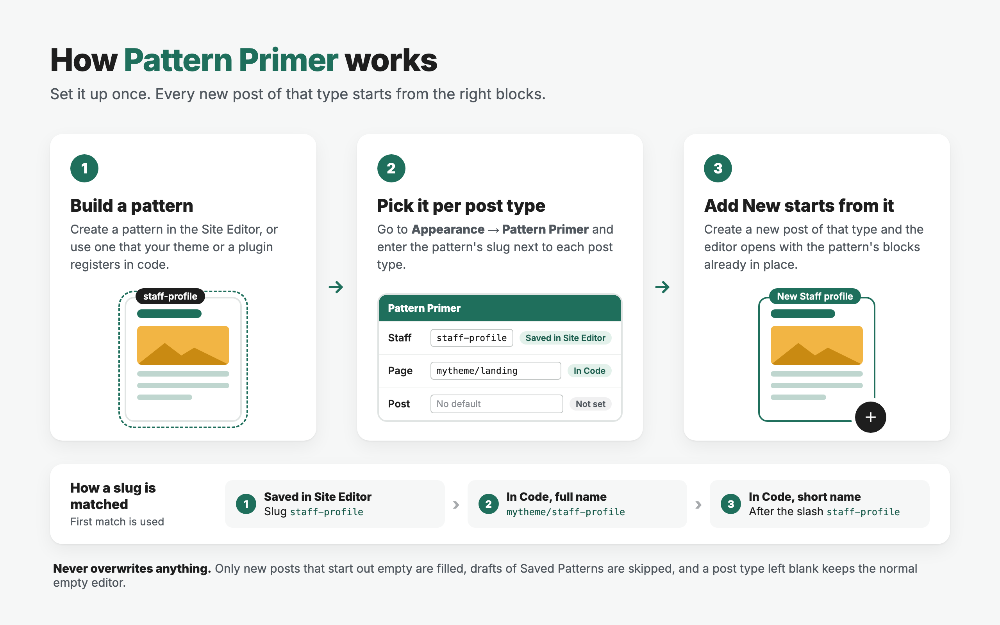

# Pattern Primer

Start every new post, page or custom post type from a block pattern you pick. Patterns saved in the Site Editor take priority over patterns in code.



**[Try it in WordPress Playground](https://playground.wordpress.net/?blueprint-url=https://raw.githubusercontent.com/bmx269/pattern-primer/main/blueprint.json)** to test the plugin in your browser, with nothing to install. The demo sets a sample pattern as the default for Posts, so *Posts → Add New* opens with it.

- **Requires:** WordPress 6.5+, PHP 8.0+
- **License:** GPLv2 or later
- **Author:** [Trent Stromkins](https://github.com/bmx269)

## Getting started

1. **Build a pattern.** Create one in the Site Editor (**Appearance → Editor → Patterns**), or use one that your theme or a plugin registers in code.
2. **Pick it for a post type.** Go to **Appearance → Pattern Primer** and enter the pattern's slug next to each post type. The field suggests every pattern on the site as you type, and the Status column confirms it was found.
3. **Add New starts from it.** New posts of that type open with the pattern's blocks already in place.

Leave a post type blank to keep the normal empty editor. Only new posts that start out empty are filled, so existing content is never changed. The settings screen's **Help** tab repeats these steps.

## Features

- Settings page under **Appearance → Pattern Primer**, listing every public post type
- Works with patterns saved in the Site Editor and patterns registered in code by themes and plugins
- Patterns saved in the Site Editor take priority over patterns in code
- Status column shows where each pattern was found, with an **Edit** link for Site Editor patterns
- Slug fields suggest the patterns available on the site as you type
- Removes its option when the plugin is deleted, on every site in a multisite network

## Installation

1. Copy the `pattern-primer` folder into `wp-content/plugins/`, or upload the zip via **Plugins → Add New → Upload Plugin**.
2. Activate the plugin from the **Plugins** screen.
3. Follow **Getting started** above.

## Slugs

For a pattern **saved in the Site Editor**, use its slug, for example `staff-profile`.

For a pattern **registered in code**, use either:

- the full registered name, e.g. `mytheme/staff-profile`, or
- the part after the slash, e.g. `staff-profile`

If no pattern matches the configured slug, the editor opens with its default blank state.

## How it works

The plugin hooks `default_content` and looks up the pattern content in this order:

1. Published database pattern (`wp_block` post type) matched by `post_name`
2. File-registered pattern matched by full registered name
3. File-registered pattern matched by the slug portion of the name

The pattern is only applied when the new post's content is empty, so content passed in another way (for example the `content` query arg) is kept. Core then hands the markup to the block editor as unsaved initial edits.

Because the new post isn't empty, core's "Choose a pattern" starter-pattern modal doesn't open for post types that have a default. Post types without one keep core's behaviour.

## Development

Main plugin file: [`pattern-primer.php`](pattern-primer.php)

Option key: `pattern_primer` (associative array, post_type => pattern slug)

Try it locally with WordPress Playground:

```bash
npx @wp-playground/cli@latest server --auto-mount
```

Build the distributable package (everything not listed in `.distignore`):

```bash
./build.sh   # build/pattern-primer/ and build/pattern-primer.zip
```

CI builds the package and runs [Plugin Check](https://wordpress.org/plugins/plugin-check/) against it on every push and pull request to `main`.

## Releasing

Publishing a GitHub release deploys to WordPress.org. The release tag (`1.2.0` or `v1.2.0`) must match the plugin header Version and the readme Stable tag, or the workflow stops. The built zip is attached to the release.

Changes to `readme.txt` or `.wordpress-org/` alone are pushed to WordPress.org on merge to `main`, once the `WPORG_SVN_READY` repository variable is `true`.

Deploys need the `SVN_USERNAME` and `SVN_PASSWORD` repository secrets. `./deploy.sh <svn-checkout>` is a manual fallback.

## Support & Contribute

- **Support:** [WordPress.org support forum](https://wordpress.org/support/plugin/pattern-primer/)
- **Bugs and feature requests:** [GitHub issues](https://github.com/bmx269/pattern-primer/issues)
- **Contribute:** pull requests are welcome against `main`.

## Changelog

### 1.0.0
- Initial release.
